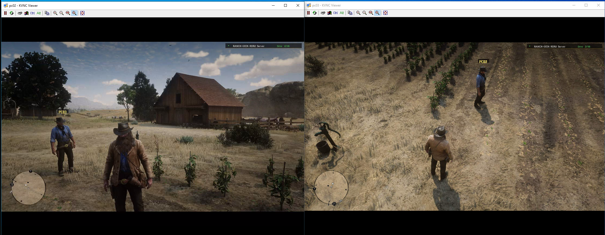

# RDR2Coop

Mod cooperativo experimental para jugar el modo historia de **Red Dead Redemption 2** con otros jugadores. El proyecto incluye un cliente C++ basado en ScriptHookRDR2, un servidor C# y sincronización de jugadores, entidades y eventos.

## Compatibilidad probada

Probado en una versión offline de RDR2 de EMPRESS. La compatibilidad puede variar según la versión del juego y de ScriptHookRDR2.

## Captura

Dos clientes de RDR2 conectados al mismo servidor. En ambas ventanas se muestra la sesión `RANCH-GEEK RDR2 Server` con 2 de 16 jugadores; cada cliente ve al otro jugador en el mundo.

## Compilación y uso

Consulta la [guía de desarrollo e instalación](INSTRUCCIONES.md) para conocer la estructura del proyecto y los pasos de compilación.
